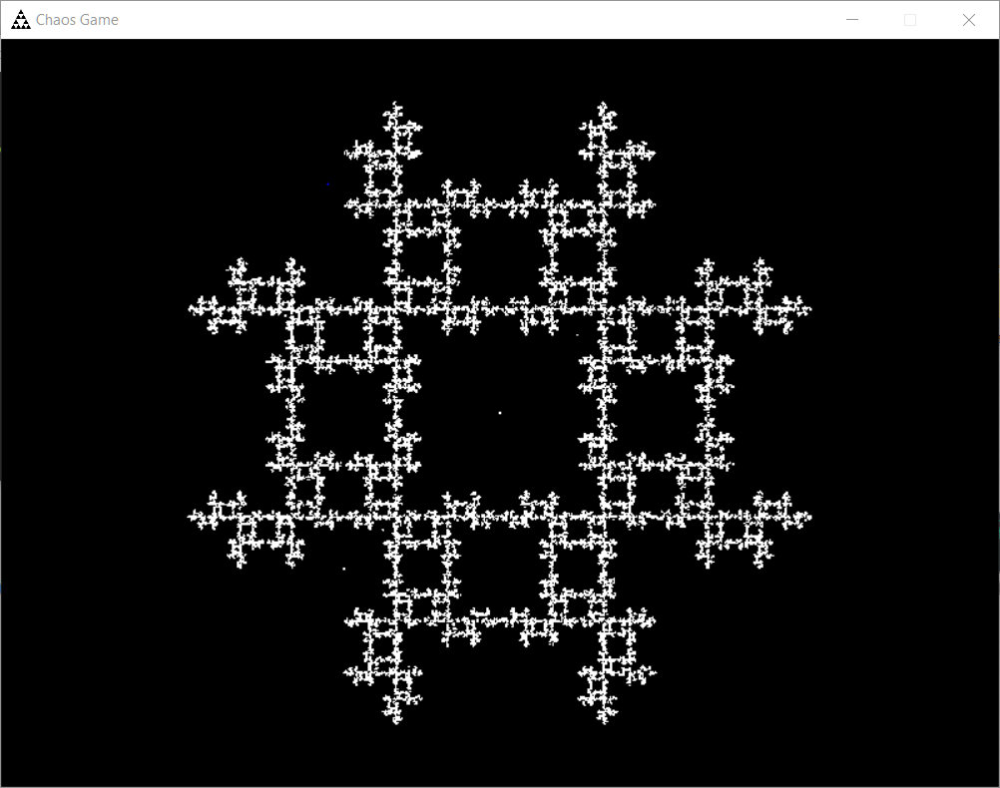

# Chaos Game
From a starting position, randomly choose a point from a set and move towards it, over and over again...

## Requirements
Lua 5
LÖVE 11.2 - https://love2d.org/

## Configuration
List of settings and descriptions located in main.lua -> love.load().

There are various rule_ functions under love.load. Each function description explains the rules purpose. Some have built in rules that can be changed by changing its corresponding rule_*_selection variable in love.load(). More choices may be added!

## Operation
Drag folder containing main over the Love icon and watch it run!

Controls
    spacebar or p: Toggle pause
	
	left arrow or a: Remove last dot
	right arrow or d: Create new dot(Works while paused)
	
## 
Cole Dieckhaus - csdhv9@mst.edu