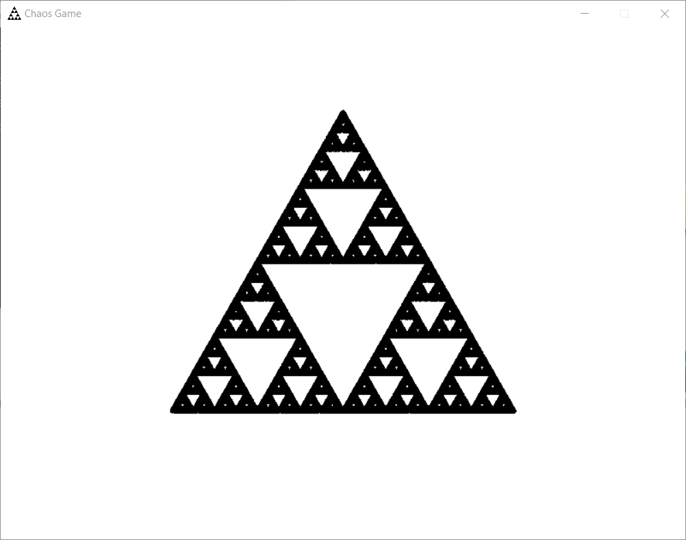
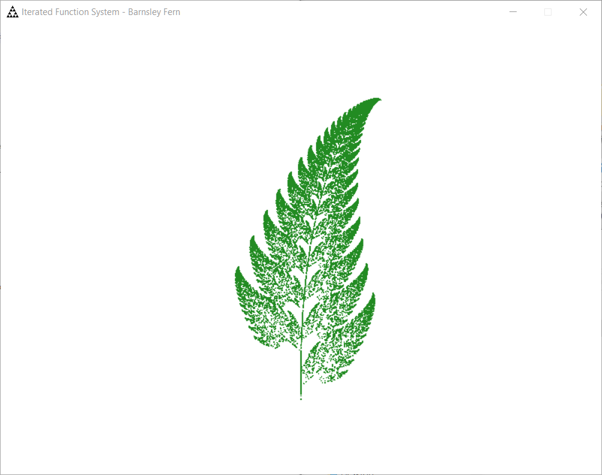

# Iterated Function Systems
This project is intended to showcase the peculiar behavior of (strange) attractors in systems portrayed in the form of a collection function visualizations for LOVE in lua.

An iterated function system is a function that has its outputs plugged back into it repeatedly. Sometimes these functions have an attractor/repellor that the system evolves towards or away from. When visualized, these attractors can produce some intersting order out of even chaos driven systems.

## Chaos Game
A customizable implementation of the chaos game. A self playing game where the past point chooses one of many points in a set to move towards, over and over again, visualizing a strange attractor.

Can itself be run.

## Barnsley Fern
Basic iterated function systems for demonstration, with a template to quickly implement unique algorithms.

Contains a few folders that can be run.

